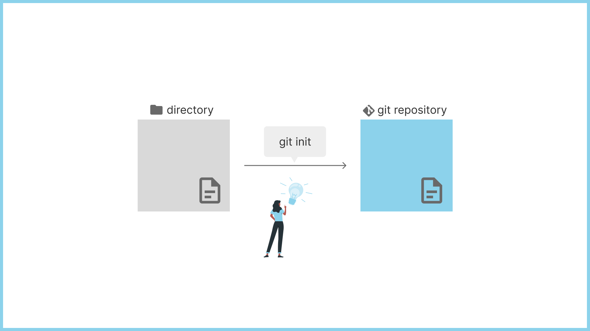
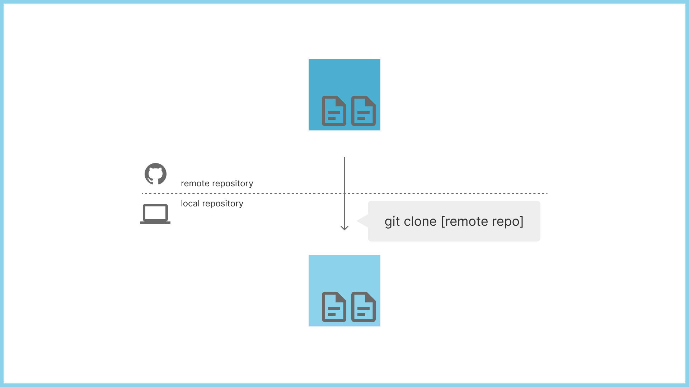

# 01 プロジェクトの作成と取得

## `git init`



`git init`は、新しいリポジトリを作成するコマンドです。  
指定したディレクトリ内に .git という隠しディレクトリを作成し、その中にリポジトリの管理に必要なファイルを生成します。  
既存のプロジェクトを Git で管理したい場合に使用します。

```sh
# 現在のディレクトリを Git リポジトリとして初期化
git init

# 指定したディレクトリを Git リポジトリとして初期化
git init myproject
```

## `git clone`



`git clone`は、リモートリポジトリの完全な複製を作成するコマンドです。  
指定したリモートリポジトリの内容を、ローカルにコピーします。  
リモートリポジトリの最新の履歴やブランチ、タグなどの情報が全て含まれます。  
他者が管理しているリポジトリを自分のマシンで作業したい場合に使用します。

```sh
# HTTPS プロトコルでクローン
git clone https://github.com/username/repository.git

# SSH プロトコルでクローン
git clone git@github.com:username/repository.git

# 特定のディレクトリにクローン
git clone https://github.com/username/repository.git mydirectory
```
